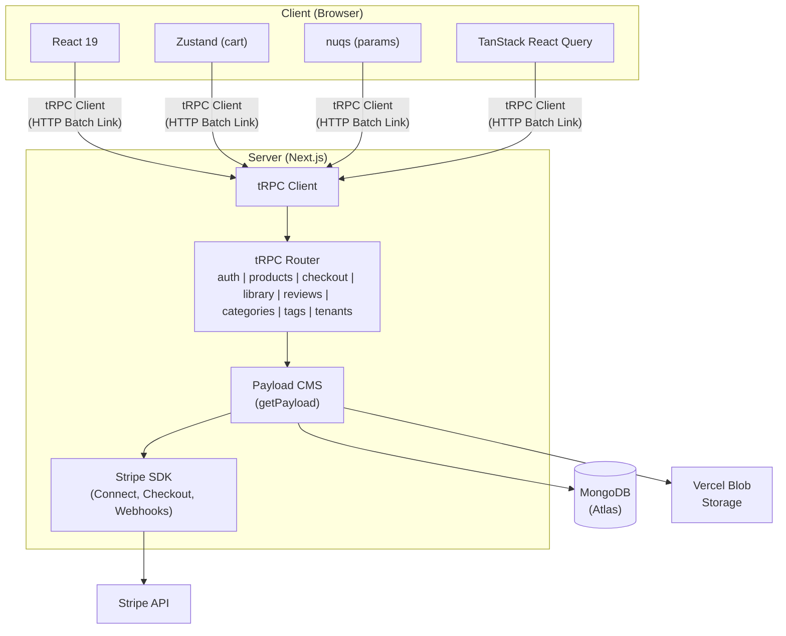
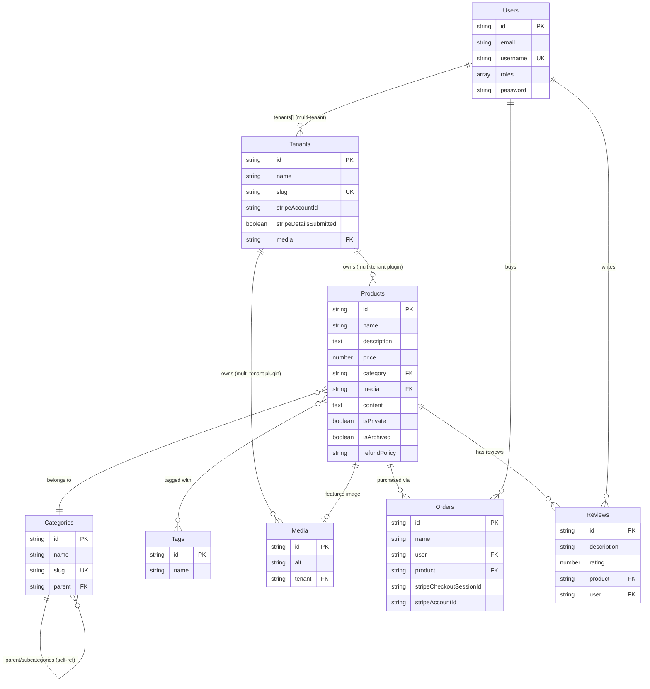
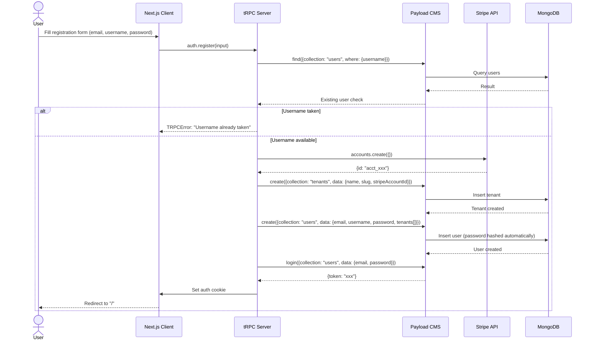
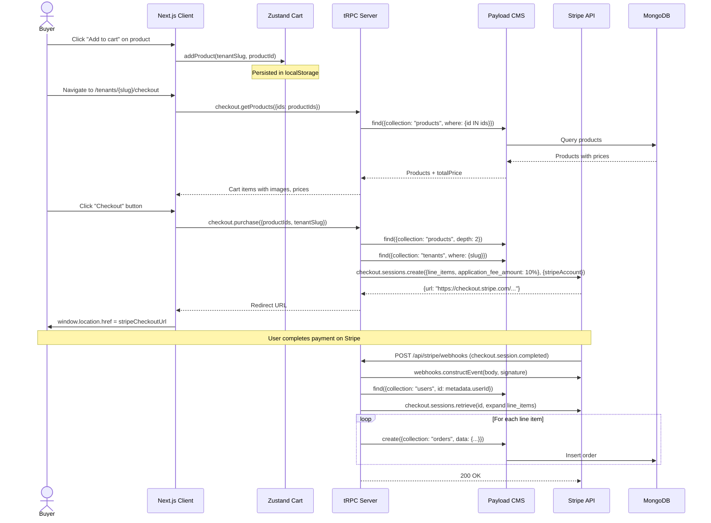
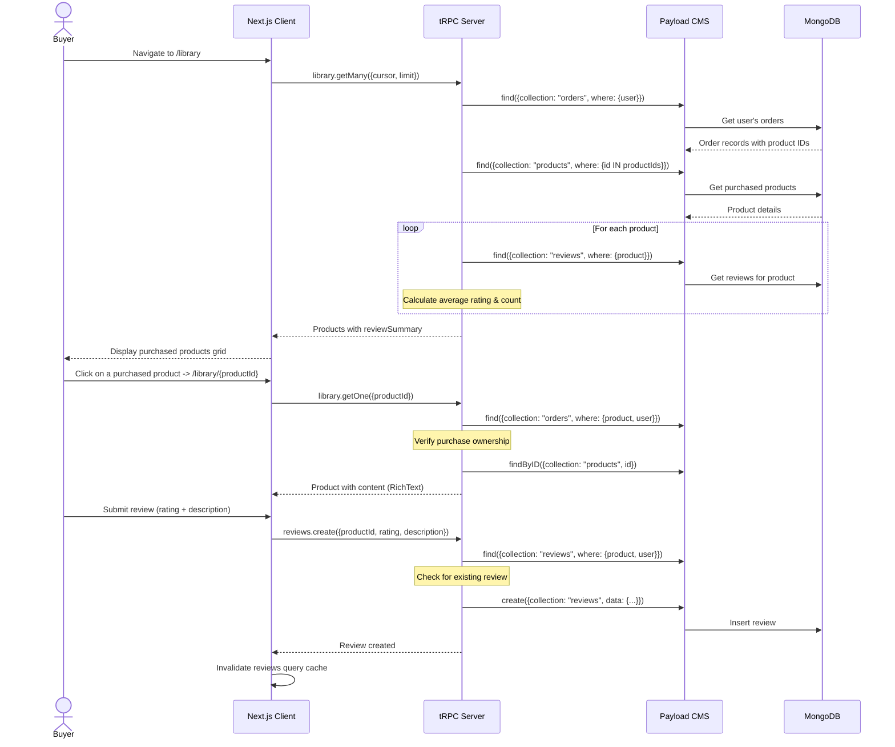
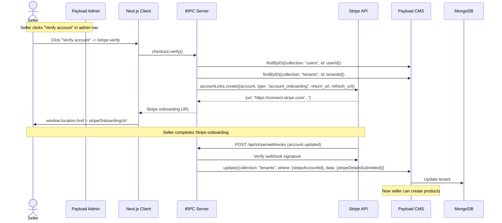
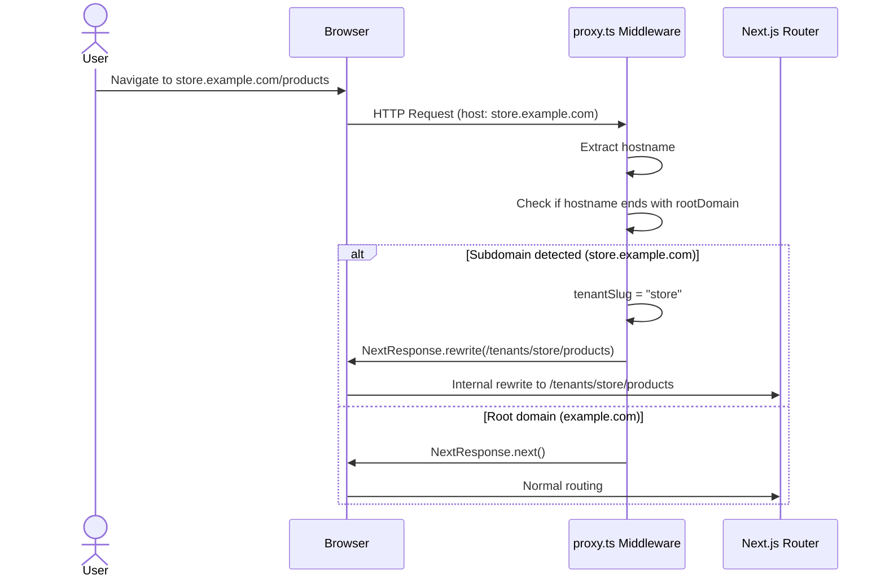
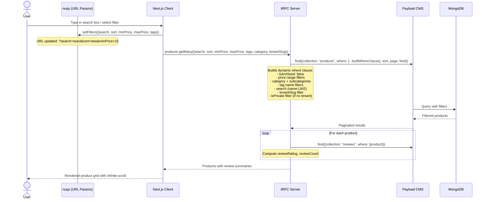
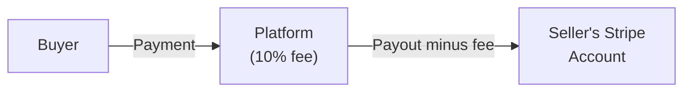

# Lvl Marketplace

A multi-tenant digital product marketplace built with Next.js, Payload CMS, and Stripe Connect. Sellers register and get their own store with Stripe onboarding, list digital products, and buyers can browse, purchase, and access content through a personal library.

---

## Table of Contents

- [Features](#features)
- [Tech Stack](#tech-stack)
- [Architecture Overview](#architecture-overview)
- [Project Structure](#project-structure)
- [Database Schema & Relationships](#database-schema--relationships)
- [Sequence Diagrams](#sequence-diagrams)
- [Environment Variables](#environment-variables)
- [Getting Started](#getting-started)
- [Available Scripts](#available-scripts)
- [Application Routes](#application-routes)
- [API Endpoints](#api-endpoints)
- [tRPC Router Reference](#trpc-router-reference)
- [Business Logic](#business-logic)
- [Access Control](#access-control)
- [Multi-Tenancy](#multi-tenancy)
- [Stripe Integration](#stripe-integration)
- [Cart System](#cart-system)
- [Deployment](#deployment)

---

## Features

- **Multi-tenant storefronts** with optional subdomain routing (`store.example.com` or `/tenants/store-slug`)
- **Stripe Connect** integration for split payments with a configurable platform fee (default 10%)
- **Digital product marketplace** with rich text content (Lexical editor), pricing, categories, tags, and refund policies
- **Buyer library** — purchased products with protected content and review system
- **Category hierarchy** — parent/child categories with responsive dropdown navigation
- **Advanced filtering** — search, price range, tags, sort order, all URL-synced via `nuqs`
- **Infinite scroll pagination** with "Load more" pattern via TanStack React Query
- **Server-side data prefetching** with React Query hydration boundaries
- **Dark mode support** with full oklch color system
- **Responsive design** — mobile sidebar navigation, adaptive grid layouts
- **Cart persistence** — Zustand store with localStorage persistence, per-tenant carts
- **Real-time form validation** with Zod schemas and react-hook-form
- **File upload** via Vercel Blob Storage
- **Payload CMS admin panel** for managing all collections

---

## Screenshots

> Place your screenshots in the `screenshots/` directory and update the image paths below.

| Page | Preview |
|------|---------|
| **Sign In** | <!--  --> |
| **Sign Up** | <!--  --> |
| **Home / Marketplace** | <!--  --> |
| **Product Detail** | <!--  --> |
| **Checkout** | <!--  --> |
| **Library** | <!--  --> |
| **Library — Product Content & Reviews** | <!--  --> |
| **Tenant Storefront** | <!--  --> |
| **Payload CMS — Dashboard** | <!--  --> |
| **Payload CMS — Product Editor** | <!--  --> |
| **Payload CMS — Categories** | <!--  --> |

<!-- Uncomment the images above and replace with your actual screenshots.
     To use:
     1. Create a `screenshots/` folder in the project root
     2. Add your .png or .jpg files there
     3. Remove the <!-- and --> comment tags around each image line
     4. Adjust filenames if needed

     Example:
     | **Sign In** |  |
-->

---

## Tech Stack

| Layer | Technology | Version |
|-------|-----------|---------|
| **Framework** | Next.js (App Router) | 16.2.6 |
| **Language** | TypeScript (strict mode) | 5.x |
| **React** | React | 19.2.4 |
| **CMS** | Payload CMS | 3.88.0 |
| **Database** | MongoDB (Mongoose adapter) | 7.x |
| **API Layer** | tRPC | 11.18.0 |
| **Data Fetching** | TanStack React Query | 5.101.4 |
| **Styling** | Tailwind CSS v4 (CSS-based config) | 4.x |
| **UI Components** | shadcn/ui (radix-nova style) | 4.8.3 |
| **Forms** | react-hook-form + Zod v4 | 7.84.0 / 4.4.3 |
| **State Management** | Zustand (cart) + nuqs (URL params) | 5.0.14 / 2.9.5 |
| **Payments** | Stripe (Connect) | 22.5.0 |
| **File Storage** | Vercel Blob Storage | — |
| **Rich Text** | Lexical Editor (via Payload) | — |
| **Icons** | Lucide React | 1.17.0 |
| **Charts** | Recharts | 3.8.0 |
| **Build** | PostCSS + @tailwindcss/postcss | — |

---

## Architecture Overview



---

## Project Structure

```
market-leveling/
│
├── app/                              # Next.js App Router
│   ├── (app)/                        # Main application group
│   │   ├── layout.tsx                # Root layout (fonts, TRPCProvider, NuqsAdapter, Toaster)
│   │   ├── globals.css               # Tailwind v4 CSS config + theme variables
│   │   │
│   │   ├── (auth)/                   # Authentication pages
│   │   │   ├── sign-in/page.tsx
│   │   │   └── sign-up/page.tsx
│   │   │
│   │   ├── (home)/                   # Public marketplace
│   │   │   ├── layout.tsx            # Navbar, SearchFilters, Footer
│   │   │   ├── page.tsx              # Home — product listings
│   │   │   ├── [category]/page.tsx   # Category-filtered products
│   │   │   ├── about/page.tsx
│   │   │   ├── contact/page.tsx
│   │   │   └── features/page.tsx
│   │   │
│   │   ├── (tenants)/                # Tenant storefronts & checkout
│   │   │   ├── stripe-verify/page.tsx
│   │   │   └── tenants/[slug]/
│   │   │       ├── (home)/           # Tenant storefront
│   │   │       │   ├── layout.tsx
│   │   │       │   ├── page.tsx
│   │   │       │   └── products/[productId]/
│   │   │       │       ├── page.tsx
│   │   │       │       └── error.tsx
│   │   │       └── (checkout)/       # Checkout flow
│   │   │           ├── layout.tsx
│   │   │           └── checkout/page.tsx
│   │   │
│   │   ├── (library)/                # Buyer library
│   │   │   ├── library/page.tsx
│   │   │   └── library/[productId]/page.tsx
│   │   │
│   │   └── api/
│   │       ├── trpc/[trpc]/route.ts  # tRPC HTTP handler
│   │       └── stripe/webhooks/route.ts  # Stripe webhook handler
│   │
│   └── (payload)/                    # Payload CMS admin
│       ├── layout.tsx
│       ├── admin/[[...segments]]/    # Admin panel pages
│       └── api/
│           ├── [...slug]/route.ts    # REST API
│           └── graphql/route.ts      # GraphQL API
│
├── collections/                      # Payload CMS collection configs
│   ├── Users.ts
│   ├── Tenants.ts
│   ├── Products.ts
│   ├── Categories.ts
│   ├── Tags.ts
│   ├── Media.ts
│   ├── Orders.ts
│   └── Reviews.ts
│
├── modules/                          # Feature-based modules
│   ├── auth/                         # Authentication
│   │   ├── schemas.ts                # Zod validation schemas
│   │   ├── utils.ts                  # Cookie generation
│   │   ├── server/procedures.ts      # tRPC router
│   │   └── ui/views/                 # Sign-in/Sign-up views
│   │
│   ├── products/                     # Product browsing
│   │   ├── search-params.ts          # Server-side nuqs param definitions
│   │   ├── types.ts                  # Inferred router output types
│   │   ├── hooks/use-product-filters.ts  # Client-side filter state
│   │   ├── server/procedures.ts      # tRPC router
│   │   └── ui/                       # Views & components
│   │
│   ├── checkout/                     # Cart & checkout
│   │   ├── types.ts                  # Stripe metadata types
│   │   ├── store/use-cart-store.ts   # Zustand cart store
│   │   ├── hooks/                    # useCart, useCheckoutStates
│   │   ├── server/procedures.ts      # tRPC router
│   │   └── ui/                       # Checkout views & components
│   │
│   ├── library/                      # Purchased products
│   │   ├── server/procedures.ts      # tRPC router
│   │   └── ui/                       # Library views & components
│   │
│   ├── home/                         # Home page components
│   │   └── ui/components/            # Navbar, Footer, SearchFilters
│   │
│   ├── tenants/                      # Tenant storefront
│   │   ├── server/procedures.ts      # tRPC router
│   │   └── ui/components/            # Tenant Navbar & Footer
│   │
│   ├── categories/                   # Categories
│   │   ├── types.ts
│   │   └── server/procedures.ts
│   │
│   ├── tags/                         # Tags
│   │   └── server/procedures.ts
│   │
│   └── reviews/                      # Reviews
│       ├── types.ts
│       └── server/procedures.ts
│
├── trpc/                             # tRPC configuration
│   ├── init.ts                       # Context, procedures (base, protected)
│   ├── client.tsx                    # Client-side tRPC provider
│   ├── server.tsx                    # Server-side tRPC caller
│   ├── query-client.ts               # QueryClient factory
│   └── routers/_app.ts              # Root router combining all sub-routers
│
├── components/                       # Shared components
│   ├── star-picker.tsx               # Interactive star rating input
│   ├── star-rating.tsx               # Read-only star rating display
│   ├── stripe-verify.tsx             # Admin nav "Verify account" button
│   └── ui/                           # shadcn/ui components (50+)
│
├── lib/                              # Utilities
│   ├── access.ts                     # Role-based access helpers
│   ├── stripe.ts                     # Stripe SDK instance
│   └── utils.ts                      # cn(), generateTenantURL(), formatCurrency()
│
├── hooks/                            # Shared hooks
│   └── use-mobile.ts                 # Mobile breakpoint detection
│
├── payload.config.ts                 # Payload CMS configuration
├── payload-types.ts                  # Auto-generated Payload types
├── proxy.ts                          # Subdomain routing middleware
├── seed.ts                           # Database seed script
├── constants.ts                      # DEFAULT_LIMIT, PLATFORM_FEE_PERCENTAGE
└── package.json
```

---

## Database Schema & Relationships

### Collections Overview

| Collection | Slug | Description | Key Fields |
|-----------|------|-------------|------------|
| **Users** | `users` | Authenticated users (buyers & sellers) | `email`, `username`, `roles`, `tenants[]` |
| **Tenants** | `tenants` | Seller stores | `name`, `slug`, `stripeAccountId`, `stripeDetailsSubmitted`, `media` |
| **Products** | `products` | Digital products for sale | `name`, `description`, `price`, `content`, `category`, `tags[]`, `media`, `isPrivate`, `isArchived`, `refundPolicy` |
| **Categories** | `categories` | Hierarchical product categories | `name`, `slug`, `parent` (self-ref), `subcategories` (join) |
| **Tags** | `tags` | Product tags for filtering | `name`, `products[]` |
| **Media** | `media` | Uploaded files (Vercel Blob) | `alt`, `tenant`, upload fields |
| **Orders** | `orders` | Purchase records | `name`, `user`, `product`, `stripeCheckoutSessionId`, `stripeAccountId` |
| **Reviews** | `reviews` | Product reviews & ratings | `description`, `rating` (1-5), `product`, `user` |

### Entity Relationship Diagram



### Relationship Details

| Relationship | Type | Description |
|-------------|------|-------------|
| **Users <-> Tenants** | Many-to-Many | Via `tenants[]` array field on Users. Each user belongs to one or more tenants. Managed by `@payloadcms/plugin-multi-tenant`. |
| **Tenants -> Products** | One-to-Many | Products are scoped to tenants via the multi-tenant plugin. `product.tenant` references the owning tenant. |
| **Tenants -> Media** | One-to-Many | Media files are scoped to tenants via the multi-tenant plugin. |
| **Products -> Categories** | Many-to-One | Each product optionally belongs to one category. |
| **Categories -> Categories** | Self-referencing | Parent/child hierarchy via `parent` relationship field and `subcategories` join field. |
| **Products <-> Tags** | Many-to-Many | Products have multiple tags; tags reference multiple products. |
| **Products -> Media** | One-to-One | Each product can have one featured image. |
| **Orders -> Users** | Many-to-One | Each order belongs to one user (the buyer). |
| **Orders -> Products** | Many-to-One | Each order references one product. |
| **Reviews -> Products** | Many-to-One | Each review belongs to one product. |
| **Reviews -> Users** | Many-to-One | Each review belongs to one user (the reviewer). |

---

## Sequence Diagrams

### 1. User Registration & Tenant Creation



### 2. Product Checkout Flow



### 3. Library & Review Flow



### 4. Stripe Account Verification (Seller Onboarding)



### 5. Subdomain Routing Middleware



### 6. Product Search & Filtering



---

## Environment Variables

Create a `.env` file in the project root:

```env
# Payload CMS
PAYLOAD_SECRET=<your-payload-secret>

# Database
DATABASE_URL=<your-mongodb-connection-string>

# Application
NEXT_PUBLIC_APP_URL=http://localhost:3000
NEXT_PUBLIC_ROOT_DOMAIN=localhost:3000
NEXT_PUBLIC_ENABLE_SUBDOMAIN_ROUTING=false

# Stripe
STRIPE_SECRET_KEY=<your-stripe-secret-key>
STRIPE_WEBHOOK_SECRET=<your-stripe-webhook-signing-secret>

# Vercel Blob Storage (optional, for media uploads)
BLOB_READ_WRITE_TOKEN=<your-vercel-blob-token>
```

### Variable Reference

| Variable | Required | Description |
|----------|----------|-------------|
| `PAYLOAD_SECRET` | Yes | Secret key used by Payload CMS for encryption and JWT signing. Generate a random string. |
| `DATABASE_URL` | Yes | MongoDB connection string. Supports MongoDB Atlas with replica set. |
| `NEXT_PUBLIC_APP_URL` | Yes | Full URL of the application (e.g., `http://localhost:3000` or `https://yourdomain.com`). Used for redirects and Stripe callbacks. |
| `NEXT_PUBLIC_ROOT_DOMAIN` | Yes | Root domain for subdomain routing (e.g., `localhost:3000` or `yourdomain.com`). Tenant stores resolve as `{slug}.{ROOT_DOMAIN}`. |
| `NEXT_PUBLIC_ENABLE_SUBDOMAIN_ROUTING` | Yes | `"true"` or `"false"`. When enabled, tenants are accessed via subdomains. When disabled, tenants are accessed via `/tenants/{slug}` path. |
| `STRIPE_SECRET_KEY` | Yes | Stripe secret API key. Use `sk_test_...` for development, `sk_live_...` for production. |
| `STRIPE_WEBHOOK_SECRET` | Yes | Stripe webhook signing secret (`whsec_...`). Configure in Stripe Dashboard under Webhooks. |
| `BLOB_READ_WRITE_TOKEN` | Optional | Vercel Blob Storage token. Required if you want to upload media files. |

---

## Getting Started

### Prerequisites

- **Node.js** 18+ (recommended: 20+)
- **npm** (or yarn/pnpm)
- **MongoDB** instance (local or [MongoDB Atlas](https://www.mongodb.com/atlas))
- **Stripe** account ([stripe.com](https://stripe.com)) with API keys
- **Vercel Blob** token (optional, for file uploads)

### Installation

1. **Clone the repository**
   ```bash
   git clone https://github.com/your-username/market-leveling.git
   cd market-leveling
   ```

2. **Install dependencies**
   ```bash
   npm install
   ```

3. **Configure environment variables**
   ```bash
   cp .env.example .env   # Or create .env manually
   ```
   Fill in all required variables as described in the [Environment Variables](#environment-variables) section.

4. **Seed the database**
   ```bash
   npm run db:seed
   ```
   This creates:
   - An admin user (`admin@demo.com` / `demo123`) with `super-admin` role
   - An admin tenant with a Stripe Connect account
   - A full category hierarchy (Business, Software Development, Writing, Education, etc.)

5. **Start the development server**
   ```bash
   npm run dev
   ```

6. **Open the application**
   - Marketplace: [http://localhost:3000](http://localhost:3000)
   - Admin Panel: [http://localhost:3000/admin](http://localhost:3000/admin)

### Stripe Webhook Setup (for production/testing)

For checkout to work end-to-end, you need to configure Stripe webhooks:

1. Install [Stripe CLI](https://stripe.com/docs/stripe-cli)
2. Login: `stripe login`
3. Forward webhooks to your local server:
   ```bash
   stripe listen --forward-to localhost:3000/api/stripe/webhooks
   ```
4. Copy the webhook signing secret (`whsec_...`) to your `.env` as `STRIPE_WEBHOOK_SECRET`

In production, add the webhook endpoint in the [Stripe Dashboard](https://dashboard.stripe.com/webhooks) pointing to `https://yourdomain.com/api/stripe/webhooks` with these events:
- `checkout.session.completed`
- `account.updated`

---

## Available Scripts

| Script | Command | Description |
|--------|---------|-------------|
| `dev` | `npm run dev` | Start Next.js development server |
| `build` | `npm run build` | Build for production |
| `start` | `npm run start` | Start production server |
| `lint` | `npm run lint` | Run ESLint |
| `generate:types` | `npm run generate:types` | Regenerate `payload-types.ts` from collection schemas |
| `generate:importmap` | `npm run generate:importmap` | Regenerate Payload admin import map |
| `payload` | `npm run payload` | Run Payload CLI commands |
| `db:fresh` | `npm run db:fresh` | Drop all collections and run migrations fresh |
| `db:seed` | `npm run db:seed` | Seed database with categories, admin user, and tenant |

---

## Application Routes

### Public Routes

| Route | Page | Description |
|-------|------|-------------|
| `/` | Home | Product marketplace with search, filters, categories |
| `/about` | About | Static about page |
| `/contact` | Contact | Static contact page |
| `/features` | Features | Static features page |
| `/{category}` | Category | Products filtered by category |
| `/{category}/{subcategory}` | Subcategory | Products filtered by subcategory |

### Authentication Routes

| Route | Page | Description |
|-------|------|-------------|
| `/sign-in` | Sign In | Email + password login. Redirects to `/` if already authenticated. |
| `/sign-up` | Sign Up | Registration form. Creates user + tenant + Stripe account. |

### Tenant Routes

| Route | Page | Description |
|-------|------|-------------|
| `/tenants/{slug}` | Storefront | Products from a specific seller |
| `/tenants/{slug}/products/{productId}` | Product Detail | Product info, description, ratings, add-to-cart |
| `/tenants/{slug}/checkout` | Checkout | Review cart items and pay via Stripe |

### Library Routes (authenticated)

| Route | Page | Description |
|-------|------|-------------|
| `/library` | Library | Grid of purchased products |
| `/library/{productId}` | Product Content | Protected content + review form |

### Utility Routes

| Route | Page | Description |
|-------|------|-------------|
| `/stripe-verify` | Stripe Verify | Redirects to Stripe Connect onboarding |
| `/admin` | Admin Panel | Payload CMS admin dashboard |

### API Routes

| Route | Method | Description |
|-------|--------|-------------|
| `/api/trpc/[trpc]` | GET, POST | tRPC HTTP batch endpoint |
| `/api/stripe/webhooks` | POST | Stripe webhook receiver |
| `/api/[...slug]` | ALL | Payload CMS REST API |
| `/api/graphql` | POST | Payload CMS GraphQL API |
| `/my-route` | GET | Example custom route |

---

## API Endpoints

### tRPC API (`/api/trpc/[trpc]`)

All data operations go through tRPC. The API uses HTTP batch links for efficient multi-query resolution.

#### `auth` Router

| Procedure | Type | Auth | Description |
|-----------|------|------|-------------|
| `auth.session` | Query | No | Get current user session |
| `auth.register` | Mutation | No | Register new user + tenant + Stripe account |
| `auth.login` | Mutation | No | Login with email/password |

#### `products` Router

| Procedure | Type | Auth | Description |
|-----------|------|------|-------------|
| `products.getOne` | Query | No | Get single product with reviews, purchase status |
| `products.getMany` | Query | No | Get paginated products with filters, sorting, search |

**`products.getMany` input parameters:**
- `cursor` (number, default: 1) — Page number
- `limit` (number, default: 8) — Items per page
- `search` (string, optional) — Search by product name
- `category` (string, optional) — Filter by category slug (includes subcategories)
- `minPrice` / `maxPrice` (string, optional) — Price range filter
- `tags` (string[], optional) — Filter by tag names
- `sort` ("picked" | "trending" | "new", default: "picked") — Sort order
- `tenantSlug` (string, optional) — Filter by tenant (used in storefront view)

#### `categories` Router

| Procedure | Type | Auth | Description |
|-----------|------|------|-------------|
| `categories.getMany` | Query | No | Get all parent categories with nested subcategories |

#### `tags` Router

| Procedure | Type | Auth | Description |
|-----------|------|------|-------------|
| `tags.getMany` | Query | No | Get paginated tags |

#### `tenants` Router

| Procedure | Type | Auth | Description |
|-----------|------|------|-------------|
| `tenants.getOne` | Query | No | Get tenant by slug |

#### `checkout` Router

| Procedure | Type | Auth | Description |
|-----------|------|------|-------------|
| `checkout.verify` | Mutation | Yes | Generate Stripe Connect onboarding link |
| `checkout.purchase` | Mutation | Yes | Create Stripe Checkout session with platform fee |
| `checkout.getProducts` | Query | No | Get products for checkout review (by IDs) |

#### `library` Router

| Procedure | Type | Auth | Description |
|-----------|------|------|-------------|
| `library.getMany` | Query | Yes | Get user's purchased products with review summaries |
| `library.getOne` | Query | Yes | Get single purchased product with content |

#### `reviews` Router

| Procedure | Type | Auth | Description |
|-----------|------|------|-------------|
| `reviews.getOne` | Query | Yes | Get current user's review for a product |
| `reviews.create` | Mutation | Yes | Create a new review (one per user per product) |
| `reviews.update` | Mutation | Yes | Update own review |

### Payload CMS REST API (`/api/[...slug]`)

Standard Payload REST endpoints for all collections:

| Method | Endpoint | Description |
|--------|----------|-------------|
| GET | `/api/{collection}` | List documents |
| GET | `/api/{collection}/{id}` | Get document by ID |
| POST | `/api/{collection}` | Create document |
| PATCH | `/api/{collection}/{id}` | Update document |
| DELETE | `/api/{collection}/{id}` | Delete document |

### Stripe Webhook Handler (`/api/stripe/webhooks`)

Handles the following events:

| Event | Action |
|-------|--------|
| `checkout.session.completed` | Creates `Order` records for each purchased line item |
| `account.updated` | Updates tenant's `stripeDetailsSubmitted` status |

---

## tRPC Router Reference

### tRPC Setup

The tRPC configuration uses:

- **`baseProcedure`** — Base procedure that initializes Payload CMS context (`ctx.db`)
- **`protectedProcedure`** — Extends base with authentication check; throws `UNAUTHORIZED` if no session
- **Superjson** — Serialization transformer for complex types (Date, etc.)
- **HTTP Batch Link** — Batches multiple queries/mutations into single HTTP requests

### Server-Side Data Fetching

Pages use server-side prefetching with React Query hydration:

```tsx
// Server component (page.tsx)
const queryClient = getQueryClient();
void queryClient.prefetchInfiniteQuery(
  trpc.products.getMany.infiniteQueryOptions({ ...filters })
);

return (
  <HydrationBoundary state={dehydrate(queryClient)}>
    <ProductListView />
  </HydrationBoundary>
);
```

### Client-Side Data Fetching

Components use `useSuspenseQuery` / `useSuspenseInfiniteQuery` for streaming-compatible data fetching:

```tsx
const { data } = useSuspenseQuery(trpc.products.getOne.queryOptions({ id }));
const { data, hasNextPage, fetchNextPage } = useSuspenseInfiniteQuery(
  trpc.products.getMany.infiniteQueryOptions({ ...filters })
);
```

---

## Business Logic

### Registration Flow

1. User fills registration form (email, username, password)
2. Username is validated: lowercase alphanumeric + hyphens, 3-63 chars, no consecutive hyphens
3. Username uniqueness is checked against the `users` collection
4. A new Stripe Connect account is created via `stripe.accounts.create()`
5. A new Tenant is created with the username as both `name` and `slug`
6. A new User is created with the tenant association and hashed password
7. User is automatically logged in and redirected to home page

### Product Creation

1. Seller must have completed Stripe onboarding (`stripeDetailsSubmitted: true`)
2. Product fields: name, description (rich text), price (USD), category, tags, image, refund policy
3. Protected content field for purchased buyers (rich text with file uploads)
4. Visibility flags: `isPrivate` (hidden from public, visible on profile), `isArchived` (hidden from everyone)

### Checkout Flow

1. Products are added to per-tenant cart (Zustand, localStorage)
2. Checkout page fetches product details via `checkout.getProducts`
3. On purchase, `checkout.purchase` creates a Stripe Checkout Session with:
   - Line items for each product (price * 100 cents)
   - 10% platform fee (`application_fee_amount`)
   - Success/cancel URLs pointing to tenant's checkout page
   - Metadata including `userId` for webhook processing
4. User is redirected to Stripe-hosted checkout page
5. On success, Stripe fires `checkout.session.completed` webhook
6. Webhook handler creates `Order` records for each purchased product
7. User is redirected to `/library` with `?success=true` parameter

### Review System

- One review per user per product
- Rating: 1-5 stars
- Written description required
- Reviews can be updated by the original author
- Product pages display aggregated ratings (average, count, distribution)
- Rating distribution shown as percentage bars

### Product Filtering & Search

Filters are URL-synced via `nuqs` for shareability:
- `?search=term` — Name search (LIKE query)
- `?sort=picked|trending|new` — Sort order
- `?minPrice=10&maxPrice=100` — Price range
- `?tags=tag1,tag2` — Tag filter

Category filtering is handled via route segments:
- `/{category}` — Filters by category and all its subcategories
- `/{category}/{subcategory}` — Filters by specific subcategory

---

## Access Control

### User Roles

| Role | Permissions |
|------|------------|
| `super-admin` | Full access to all collections, can manage users/tenants/categories/tags, hidden admin collections become visible |
| `user` | Can edit own profile, create products (if Stripe verified), access library, leave reviews |

### Collection Access Rules

| Collection | Read | Create | Update | Delete |
|-----------|------|--------|--------|--------|
| **Users** | Everyone | Super admin only | Self or super admin | Super admin only |
| **Tenants** | — | Super admin only | — | Super admin only |
| **Products** | Everyone | Verified sellers (stripeDetailsSubmitted) | — | Super admin only |
| **Categories** | Everyone | Super admin only | Super admin only | Super admin only |
| **Tags** | Everyone | Super admin only | Super admin only | Super admin only |
| **Media** | Everyone | — | — | Super admin only |
| **Orders** | Super admin only | Super admin only | Super admin only | Super admin only |
| **Reviews** | Super admin only | Super admin only | Super admin only | Super admin only |

---

## Multi-Tenancy

### How It Works

Each seller gets a **Tenant** record when they register. The multi-tenant plugin (`@payloadcms/plugin-multi-tenant`) automatically scopes:

- **Products** — Each product belongs to a tenant
- **Media** — Each media file belongs to a tenant

### Tenant URL Generation

```ts
// lib/utils.ts
export function generateTenantURL(tenantSlug: string) {
  // Development or subdomain routing disabled:
  //   http://localhost:3000/tenants/{slug}

  // Production with subdomain routing:
  //   https://{slug}.example.com
}
```

### Subdomain Routing

The `proxy.ts` middleware handles subdomain-based tenant resolution:

```ts
// If host is "store.example.com" and ROOT_DOMAIN is "example.com":
// Rewrite to /tenants/store/{original-path}
```

Enable by setting `NEXT_PUBLIC_ENABLE_SUBDOMAIN_ROUTING=true`.

---

## Stripe Integration

### Architecture

The platform uses **Stripe Connect** for multi-tenant payments:



### Flow

1. **Registration** — Each new user gets a Stripe Connect account (`acct_...`)
2. **Onboarding** — Seller completes Stripe's identity verification via Account Links
3. **Product Listing** — Only verified sellers (`stripeDetailsSubmitted: true`) can create products
4. **Checkout** — Stripe Checkout Session created on the seller's connected account with `application_fee_amount` for the platform
5. **Webhooks** — Platform receives events and creates Order records

### Platform Fee

Default: **10%** (defined in `constants.ts` as `PLATFORM_FEE_PERCENTAGE`)

### Webhook Events

| Event | Processing |
|-------|-----------|
| `checkout.session.completed` | Creates Order records for each line item purchased |
| `account.updated` | Updates tenant's `stripeDetailsSubmitted` flag |

---

## Cart System

### Storage

- **Zustand** store with `persist` middleware
- Stored in `localStorage` under key `lvl-cart`
- Per-tenant cart isolation (sellers can't mix products from different stores)

### State Shape

```ts
interface CartState {
  tenantCarts: Record<string, {
    productIds: string[];
  }>;
}
```

### Cart Hook (`useCart`)

```ts
const {
  productIds,      // Current cart items
  totalItems,      // Item count
  addProduct,      // Add item to cart
  removeProduct,   // Remove item from cart
  toggleProduct,   // Toggle item in/out of cart
  isProductInCart, // Check if item is in cart
  clearCart,       // Clear cart for current tenant
  clearAllCarts,   // Clear all tenant carts
} = useCart(tenantSlug);
```

### Checkout State

URL-based success/cancel states managed via `nuqs`:
- `?success=true` — Triggers cart clearing and redirect to library
- `?cancel=true` — Shows error message in checkout sidebar

---

## Deployment

### Vercel (Recommended)

1. Push to GitHub
2. Import project in [Vercel Dashboard](https://vercel.com)
3. Configure environment variables
4. Deploy

### Production Checklist

- [ ] Set `NEXT_PUBLIC_APP_URL` to production URL
- [ ] Set `NEXT_PUBLIC_ROOT_DOMAIN` to production domain
- [ ] Set `NEXT_PUBLIC_ENABLE_SUBDOMAIN_ROUTING` appropriately
- [ ] Use production Stripe keys (`sk_live_...`, `pk_live_...`)
- [ ] Configure Stripe webhooks for production domain
- [ ] Set secure `PAYLOAD_SECRET` (generate a new one)
- [ ] Set up MongoDB Atlas with proper indexing
- [ ] Configure Vercel Blob Storage for media uploads
- [ ] Update Stripe webhook endpoint in Stripe Dashboard
- [ ] Run `npm run build` to verify production build

### Seed Database (Production)

```bash
npm run db:seed
```

Or reset and re-seed:
```bash
npm run db:fresh && npm run db:seed
```

---

## Default Seed Data

After running `npm run db:seed`, the following data is created:

### Admin User
- **Email:** `admin@demo.com`
- **Password:** `demo123`
- **Role:** `super-admin`

### Categories
- All
- Business & Money (9 subcategories: Accounting, Entrepreneurship, Gigs & Side Projects, Investing, Management & Leadership, Marketing & Sales, Networking Careers & Jobs, Personal Finance, Real Estate)
- Software Development (5 subcategories: Web Development, Mobile Development, Game Development, Programming Languages, DevOps)
- Writing & Publishing (5 subcategories: Fiction, Non-Fiction, Blogging, Copywriting, Self-Publishing)
- Education (4 subcategories: Online Courses, Tutoring, Test Preparation, Language Learning)
- Self Improvement (4 subcategories: Productivity, Personal Development, Mindfulness, Career Growth)
- Fitness & Health (4 subcategories: Workout Plans, Nutrition, Mental Health, Yoga)
- Design (4 subcategories: UI/UX, Graphic Design, 3D Modeling, Typography)
- Drawing & Painting (5 subcategories: Watercolor, Acrylic, Oil, Pastel, Charcoal)
- Music (4 subcategories: Songwriting, Music Production, Music Theory, Music History)
- Photography (5 subcategories: Portrait, Landscape, Street Photography, Nature, Macro)
- Other

---

## Key Design Decisions

1. **No `src/` directory** — Project uses root-level directories (`app/`, `components/`, `modules/`, etc.)
2. **Tailwind CSS v4** — CSS-based configuration, no `tailwind.config.ts` file. Theme defined in `globals.css` using `@theme inline` and CSS custom properties.
3. **Module-based architecture** — Each feature (auth, products, checkout, etc.) is self-contained in `modules/` with its own types, hooks, server procedures, and UI components.
4. **oklch color system** — Full light/dark theme using oklch color space for perceptually uniform colors.
5. **Flat UI components** — `rounded-none` used throughout for a sharp, modern aesthetic inspired by Tokopedia's design language.
6. **Server-first data fetching** — Pages prefetch data on the server with React Query hydration boundaries, then client components take over with suspense-based streaming.
